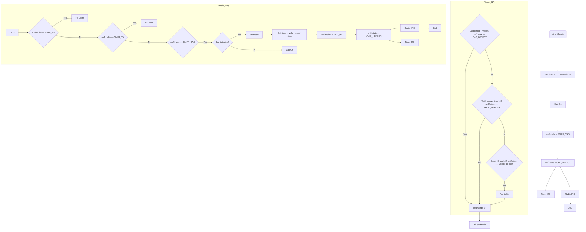

<!--
 * @Author: your name
 * @Date: 2020-04-24 13:53:57
 * @LastEditTime: 2020-04-25 19:56:10
 * @LastEditors: Please set LastEditors
 * @Description: In User Settings Edit
 * @FilePath: \mixer_dutycycle\Doc\chirp_sniff.md
 -->

1. 方向
TB	从上到下
BT	从下到上
RL	从右到左
LR	从左到右

2. 连线类型
>	添加尾部箭头
-	不添加尾部箭头
–	单线
–text–	单线上加文字
==	粗线
==text==	粗线加文字
-.-	虚线
-.text.-	虚线加文字

1. 节点
表述	说明
id[文字]	矩形节点
id(文字)	圆角矩形节点
id((文字))	圆形节点
id>文字]	右向旗帜状节点
id{文字}	菱形节点